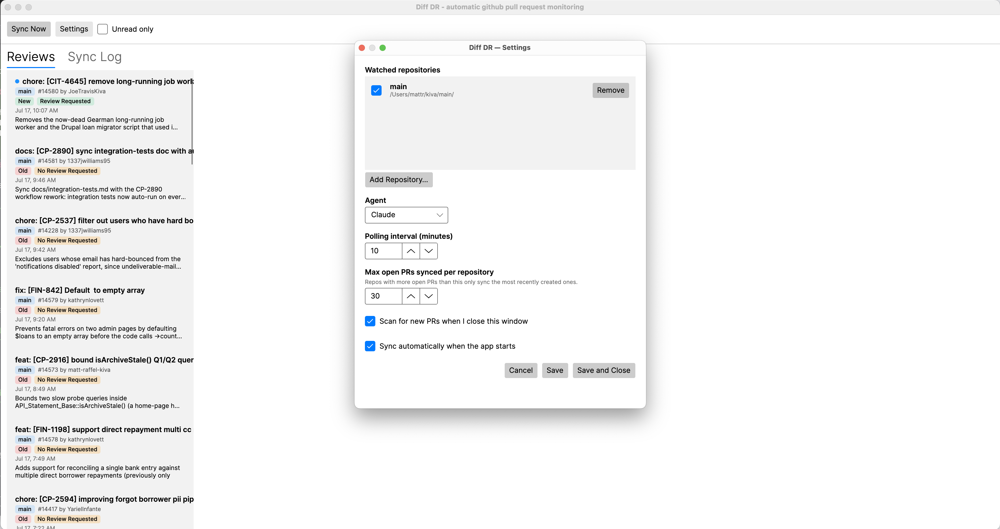

# pr-thingy

A cross-platform desktop app that flips PR review from reactive to proactive. `pr-thingy` quietly
watches your local git clones, pulls open PR data via the GitHub CLI, and asks a coding-agent CLI
(Claude Code or Gemini) to write a plain-English briefing for each PR — the *why* behind the
change, the highest-impact files touched, and the top risks to watch for — before you ever open
GitHub.

See [`docs/design.md`](docs/design.md) for the original design concept and
[`docs/plan1.md`](docs/plan1.md) for the earlier automation idea this app's background sync
mirrors.

## How it works



1. You add one or more **local repo clones** to watch (Settings → Add Repository). pr-thingy talks
   to GitHub through the `gh` CLI running inside each clone, so it needs a real local checkout —
   not just a GitHub URL — with an `origin` remote pointing at the repo you want to monitor.
2. On a configurable interval (default 60 minutes) or on demand ("Sync Now"), for each watched
   repo pr-thingy:
   - runs `git fetch origin` to bring the clone up to date
   - runs `gh pr list` / `gh pr diff` to pull open PR data
   - asks your configured agent (`claude -p` or `gemini -p`) to summarize each new or updated PR
     into a fixed JSON shape (why / high-impact files / top risks)
   - saves the structured briefing to disk
3. The dashboard lists every briefing, sorted most-recent-first, with read/unread state, an
   unread-only filter, and a full detail view per PR (with a link back to GitHub).

A briefing is only regenerated when the PR itself changes (tracked via GitHub's PR `updatedAt`
timestamp), not on every sync.

## Prerequisites

- .NET 10 SDK
- GitHub CLI (`gh`) and an agent CLI (`claude` and/or `gemini`), both installed and authenticated
- Local git clones of the repositories you want to monitor

See [`docs/setup-and-troubleshooting.md`](docs/setup-and-troubleshooting.md) for full setup steps,
what the app shows when something's wrong, and how to fix common problems.

## Getting started

```bash
dotnet build
dotnet run --project src/PrThingy.App
```

On first run, open **Settings**, click **Add Repository** and pick a local clone, choose an agent
(Claude or Gemini), set a polling interval, then **Save and Close** — this also kicks off an
immediate sync by default (toggleable via the "Scan for new PRs when I close this window"
checkbox).

Closing the main window quits the app, including the background polling loop.

## Project structure

```
pr-thingy.sln                      # solution file (repo root, per docs/design.md)
Directory.Build.props            # shared TargetFramework/Nullable/LangVersion
Directory.Packages.props         # central NuGet package versions
docs/
  design.md                      # target shape: cross-platform GUI app
  plan1.md                       # original automation idea pr-thingy's background sync mirrors
  setup-and-troubleshooting.md   # what to install/authenticate, and how to diagnose failures
src/
  PrThingy.Core/                   # domain models, interfaces, orchestration — no I/O
  PrThingy.Infrastructure/         # gh/claude/gemini CLI shelling, file-based storage, background sync
  PrThingy.App/                    # Avalonia UI (dashboard, settings)
  PrThingy.Tests/                  # xUnit + Moq tests for Core/Infrastructure
```

### Architecture

`PrThingy.Core` defines the abstractions the rest of the app is built on:

- `IPullRequestSource` — fetching PR data (implemented by `GhCliPullRequestSource`, which shells
  out to `gh`)
- `IAgentClient` / `IAgentClientFactory` — generating a briefing from a prompt (implemented by
  `ClaudeCliAgentClient` / `GeminiCliAgentClient`, both sharing CLI-invocation logic via
  `CliAgentClientBase`)
- `IBriefingRepository`, `IWatchedRepositoryStore`, `IAppSettingsStore` — persistence (implemented
  as file-based JSON stores in `PrThingy.Infrastructure/Storage`)

Everything is behind an interface so, for example, the file-based storage could later be replaced
with a database-backed implementation without touching `PrSyncOrchestrator` or the UI.

## Where data lives

Settings and briefings are stored as JSON files in your OS's app-data directory (not inside the
repo):

- **Windows**: `%APPDATA%\PrThingy`
- **macOS**: `~/Library/Application Support/PrThingy`
- **Linux**: `$XDG_DATA_HOME/pr-thingy` (falls back to `~/.local/share/pr-thingy`)

```
briefings/<repository-storage-key>/pr-<number>.json
repositories.json
settings.json
logs/
```

## Testing

```bash
dotnet test
```

34 tests cover agent-response parsing (including malformed/fenced JSON fallback), prompt
building, sync/re-summarization logic (via fakes/mocks), file-based storage round-trips against
temp directories, and subprocess execution via `ProcessRunner`.

## Known limitations

- No background/tray mode currently — closing the main window quits the app entirely. See
  `docs/design.md`'s "Invisible Assistant" concept for the deferred direction; a prior
  implementation attempt (`PrThingy.App/Services/TrayIconService.cs`, currently unwired) ran into
  macOS menu-bar reliability issues when launched via `dotnet run` instead of a packaged `.app`.
- The Gemini CLI path is implemented against its documented `-p` flag but hasn't been exercised
  end-to-end in this environment (Node runtime predates gemini-cli's Node 20+ requirement); the
  Claude CLI path has been verified end-to-end.
- No packaged installers yet (MSI/DMG/AppImage) — run via `dotnet run`, or `dotnet build` and use
  the produced binary directly.

## License

[Apache License 2.0](LICENSE)

## File Version
2026.07.17